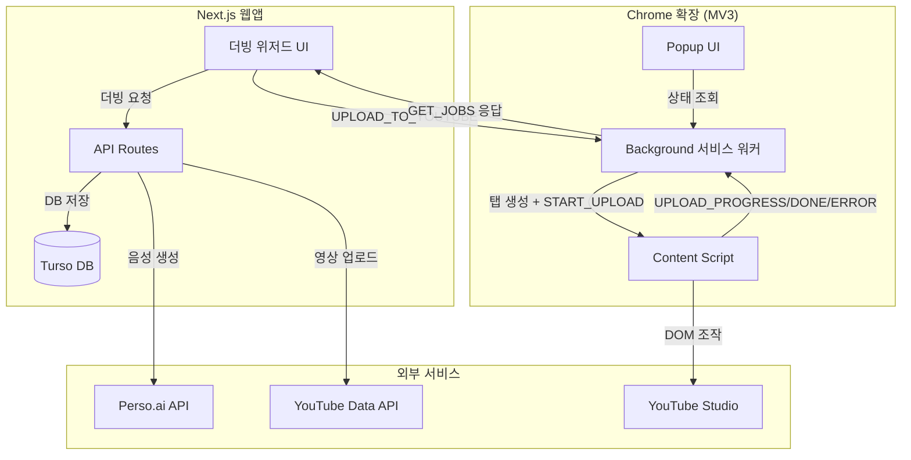

# sub2tube

[🇰🇷 한국어](./README.md) | [🇺🇸 English](./docs/readme/README.en.md) | [🇯🇵 日本語](./docs/readme/README.ja.md) | [🇨🇳 中文](./docs/readme/README.zh.md)

> **YouTube 크리에이터를 위한 AI 다국어 더빙 & 업로드 자동화 플랫폼.**
> 영상 한 편을 올리면 여러 언어로 더빙하고, 자막과 함께 YouTube에 자동 업로드한 뒤 대시보드에서 시청 분석까지 확인할 수 있습니다.

[Perso.ai](https://developers.perso.ai) API 기반으로 동작하며, 크리에이터 친화적인 작업 흐름을 제공합니다.

## 주요 기능

- **AI 다국어 더빙** — 영상을 5단계 위저드로 업로드하면 원본 화자 톤을 보존한 채 여러 언어로 자동 더빙합니다.
- **립싱크** — 선택 시 번역된 음성에 맞춰 입 모양을 보정합니다.
- **스크립트 편집** — 번역 결과를 문장 단위로 수정하고 음성을 재생성할 수 있습니다.
- **YouTube 자동 업로드** — 더빙된 영상을 서버 경유로 YouTube Data API v3에 업로드하고, 자막(SRT)도 함께 게시합니다.
- **Multi-audio Track 도우미** — YouTube의 다중 오디오 트랙 미지원 환경에서도 언어별 영상을 체계적으로 관리할 수 있도록 보조합니다.
- **Chrome 확장 (YouTube Studio 자동화)** — 웹앱에서 생성한 오디오를 Chrome 확장이 YouTube Studio에서 자동으로 오디오 트랙에 추가합니다. 셀렉터 fallback 체인 + 재시도 + assisted/auto 모드 지원.
- **크레딧 시스템** — 영상 길이(분) 기반으로 크레딧을 사전 검증하고, 완료 시 차감합니다.
- **대시보드 & 분석** — 언어별 조회수·좋아요, 월별 크레딧 사용, YouTube Analytics 연동 데이터를 제공합니다.

## 기술 스택

| 영역 | 기술 |
| ---- | ---- |
| 프레임워크 | Next.js 16.2.6 (App Router) |
| 런타임 | React 19, TypeScript 5 |
| 스타일 | Tailwind CSS v4 |
| 상태 관리 | Zustand 5 |
| 데이터 페칭 | TanStack React Query v5 |
| 스키마 검증 | Zod v4 |
| 데이터베이스 | Turso (libSQL) — `@libsql/client` |
| 더빙 엔진 | Perso.ai API |
| 업로드/통계 | YouTube Data API v3 + Analytics API v2 |
| 인증 | Google OAuth 2.0 + 서버 세션 쿠키 |
| 테스트 | Vitest, Playwright, Lighthouse |
| Chrome 확장 | Manifest V3, Vite 7, TypeScript |

## 아키텍처



> **주의:** 이 프로젝트는 Next.js 16의 파괴적 변경(breaking changes)에 기반합니다. 코드 수정 전 반드시 `node_modules/next/dist/docs/` 의 관련 가이드를 참고하세요.

## 시작하기

### 사전 준비

- Node.js 20+
- [Perso.ai](https://developers.perso.ai) API 키
- Turso 데이터베이스
- Google Cloud Console 프로젝트 (OAuth + YouTube Data API 활성화)

### 설치

```bash
git clone https://github.com/perso-devrel/sub2tube.git
cd sub2tube
npm install
```

### 환경변수 설정

`.env.example` 을 복사하여 `.env.local` 파일을 생성하세요.

```bash
cp .env.example .env.local
```

```env
# Perso.ai
PERSO_API_KEY=
PERSO_API_BASE_URL=https://api.perso.ai
NEXT_PUBLIC_PERSO_FILE_BASE_URL=https://perso.ai

# Google OAuth
NEXT_PUBLIC_GOOGLE_CLIENT_ID=
GOOGLE_CLIENT_SECRET=

# 세션 (쿠키 서명용)
SESSION_SECRET=

# Turso DB
TURSO_URL=
TURSO_AUTH_TOKEN=

# Chrome 확장 연동 (chrome://extensions에서 확장 ID 확인)
NEXT_PUBLIC_EXTENSION_ID=
```

### 개발 서버

```bash
npm run dev         # http://localhost:3000
```

### 테스트 & 검증

```bash
npx tsc --noEmit              # 타입 체크
npm run lint                  # ESLint
npm run test                  # Vitest (유닛)
npm run build                 # 프로덕션 빌드
npm run test:e2e              # Playwright E2E
npm run test:lighthouse:gate  # Lighthouse 성능 게이트
```

## 프로젝트 구조

```
extension/                  # Chrome 확장 (MV3) — 별도 README 참조
src/
├── app/                    # Next.js App Router
│   ├── (app)/              # 인증이 필요한 라우트 (dashboard, dubbing, batch, billing, youtube, uploads, settings)
│   ├── (marketing)/        # 랜딩 등 공개 페이지
│   ├── api/                # Route Handlers
│   │   ├── auth/           # 로그인, 세션, 토큰 동기화
│   │   ├── dashboard/      # mutations(단일 엔드포인트), jobs, summary, credit-usage, language-performance
│   │   ├── perso/          # Perso.ai 프록시 (spaces, upload, project, queue, progress, download …)
│   │   └── youtube/        # upload, caption, stats, analytics, videos
│   └── layout.tsx
├── features/               # 도메인별 기능 그룹
│   ├── dubbing/            # 5단계 위저드, Zustand 스토어, 타입
│   ├── dashboard/          # 차트·테이블·요약 카드
│   ├── landing/            # 랜딩 섹션
│   ├── auth/               # OAuth UI
│   └── billing/            # 크레딧·요금제
├── lib/
│   ├── db/                 # libSQL 클라이언트 + queries/{users,jobs,youtube,dashboard}
│   ├── perso/              # persoFetch 래퍼, 에러 매핑, 라우트 헬퍼
│   ├── youtube/            # 업로드, 자막, 통계, 분석
│   ├── validators/         # Zod 스키마 (discriminated union 기반 mutation)
│   ├── auth/               # 세션 검증
│   └── env.ts              # 환경변수 파싱
├── stores/                 # Zustand (auth, notification, theme)
├── hooks/                  # React Query 훅
├── components/             # 공용 UI + 레이아웃 + 프로바이더
└── services/               # 외부 API 서비스 레이어
```

## 더빙 워크플로우

```
영상 입력 → 언어 선택 → 스크립트 편집 → 처리 → 업로드
```

1. **영상 입력** — YouTube URL 또는 로컬 업로드. 메타데이터를 Perso 공간(space)에 등록.
2. **언어 선택** — 원본 언어(자동 감지)와 대상 언어 다중 선택, 립싱크 ON/OFF.
3. **스크립트 편집** — 번역된 자막을 문장 단위로 수정하거나 특정 구간을 제외 처리.
4. **처리(Processing)** — Perso API 로 더빙 작업을 생성하고 진행률을 폴링합니다.
5. **업로드** — 완료된 결과를 YouTube 에 자동 업로드 (제목/설명/태그/공개설정 편집 모달 제공).

## 알려진 제약

- YouTube 다중 오디오 트랙 API는 미지원 — 언어별 별도 영상 업로드 방식으로 우회합니다.
- Perso `progressReason` 값은 UPPERCASE / PascalCase 가 혼재하므로 두 형태 모두 처리해야 합니다.

## 문서

기술 문서는 [`docs/README.md`](./docs/README.md) 인덱스에서 카테고리별로 확인할 수 있습니다.

- 설계 · 운영: [`docs/ARCHITECTURE.md`](./docs/ARCHITECTURE.md), [`docs/OPERATIONS_RUNBOOK.md`](./docs/OPERATIONS_RUNBOOK.md), [`docs/EXTENSION_STRUCTURE.md`](./docs/EXTENSION_STRUCTURE.md)
- 품질 · 보안: [`docs/QA_CHECKLIST.md`](./docs/QA_CHECKLIST.md), [`docs/SECURITY_AUDIT.md`](./docs/SECURITY_AUDIT.md), [`docs/SECURITY_SWEEP.md`](./docs/SECURITY_SWEEP.md), [`docs/PERFORMANCE_RELEASE_AUDIT.md`](./docs/PERFORMANCE_RELEASE_AUDIT.md), [`docs/SELECTORS_TO_VERIFY.md`](./docs/SELECTORS_TO_VERIFY.md)
- 다국어 README: [`docs/readme/`](./docs/readme/)
- Chrome 확장: [`extension/README.md`](./extension/README.md)

기획·요구사항·시장 조사 등 비즈니스 산출물은 별도 문서 저장소에서 관리됩니다.

## 기여하기

1. 저장소 Fork
2. 기능 브랜치 생성 (`git checkout -b feature/awesome`)
3. 커밋 (`git commit -m 'feat: add awesome'`)
4. Push & Pull Request

Git Flow: `main ← develop ← 이슈 브랜치`, squash 머지. `main`/`develop` 은 영구 브랜치이며 삭제 금지입니다.

## 보안

보안 취약점은 **공개 이슈로 보고하지 마세요.** GitHub Private Vulnerability Reporting 을 사용해 주세요. 자세한 절차는 [.github/SECURITY.md](./.github/SECURITY.md) 를 참고하세요.

## 라이선스

이 저장소는 비공개(Proprietary) 입니다. 모든 권리를 저작권자가 보유합니다. 별도 서면 허가 없이 재배포·재사용할 수 없습니다.

## 감사의 말

- [Perso.ai](https://perso.ai) — AI 더빙 엔진
- [Turso](https://turso.tech) — 데이터베이스
- [Vercel](https://vercel.com) — 배포 플랫폼
- 자매 프로젝트 [AniVoice](https://github.com/perso-devrel/anivoice) — 유사한 Perso 기반 더빙 플랫폼
